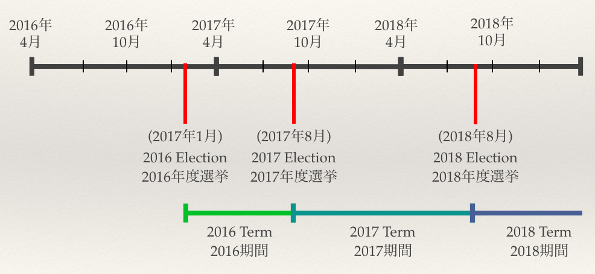

# How to become a candidate

To be a candidate for the 2016 term, send an email to NAISTStudentCouncil@gmail.com with the following content before 23 January 2017:

* Your name / 名前
* A photo of you / 写真 (400x400 px)
* A short introduction / 自己紹介　(<100 words)
* Your student ID / 学生番号
* Your grade/year / 学歴 (M1, D1, D2...)

Note that this information will be hosted publically during and after the election.

## Duties

As a council member, you will be expected to attend the meetings of the association. The 7 council members also have to select a President, Vice President and Treasurer.

## Election terms

Members of the student council are elected for one year. Elections are normally in August. The first election (2016 Term) will be held from 25 - 30 January 2017.

[back](./)
