# Candidates for the election 2016/2017

# 2016年度選挙の立候補者

In alphabetical order. ABC順です。

- [Abi Uy](#abi)
- [Adrian Chek](#adrian)
- [Antonio Tejero de Pablos](#antonio)
- [Arnaud Delmotte](#arnaud)
- [Atsushi Yodo (淀淳)](#atsushi)
- [Felix von Drigalski](#felix)
- [Izumi Dateyama](#izumi)
- [Max (Taishi Sawabe)](#max)
- [Pedro Miguel Uriguen Eljuri](#pedro)
- [Miguel Angel Patino Gonzalez](#miguel)
- [Rodrigo Elizalde](#rodrigo)
- [Yasuhiro Otoda](#otoda)

**[How to vote / 投票方法](../voting)**

---

###  **Abi Uy** (*BS, M1*)
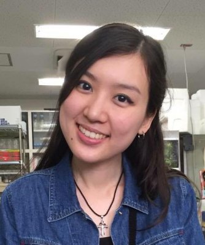

I am Abi Uy, a Filipino student pursuing doctorate studies in the Biological Science division of NAIST. I am applying for a position in the student association because I wish to contribute a bit of my time and effort to represent the student body, help express their concerns to the administration, and contribute to organizing campus activities for the students.

フィリピンから来たアビ・ウイです。バイサイエンスで博士課程へ進学予定です。学生会で学生代表や運営との議論、学生のためのキャンパスイベントの開催などに尽力するため、立候補しました。よろしくお願いします！

---

###  **Adrian (CHEK Min Fey)** (*BS, D3*)
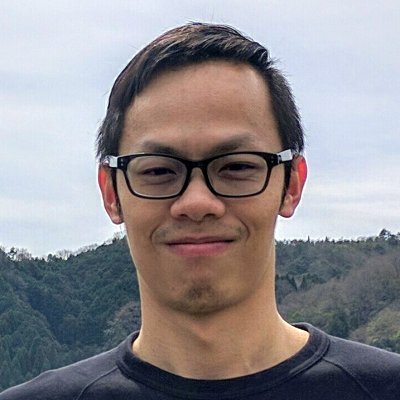

Hi! I'm Adrian, a Malaysian D3 student in Bio School. Besides studying, I like to swim, bike and run. I speak Mandarin, Malay and English, and I am working on my Japanese!

こんにちは！僕はエイドリアン、マレーシアのD3のバイオの学生です。研究以外に、水泳、自転車とランニング好きです。中国語、マレーと英語をしゃべられます。日本語も頑張ります！

---

###  **Antonio Tejero de Pablos** (*IS, D3*)
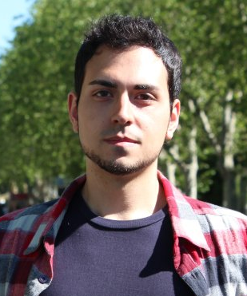

テヘーロデパブロス アントニオ（スペイン）は情報科学研究科の視覚情報メディア研究室のD3の学生です。
彼はNAIST剣道部の部長であり、他のサークルにも参加しています：VSP、NASC、NAISTボランティア、リサイクリングサークル。彼は日本学生と留学生のインタラクションを促進するのが目標です。

Antonio Tejero-de-Pablos (Spanish) is a D3 student at the Vision and Media Computing Lab, at the IS department.
He is also the president of NAIST kendo club, and member of other clubs: VSP, NASC, NAIST volunteering, Recycling club.
He wants to promote the interaction between Japanese and international students.

---

###  **Arnaud Delmotte** (*IS, D1 (from April / 4月から)*)
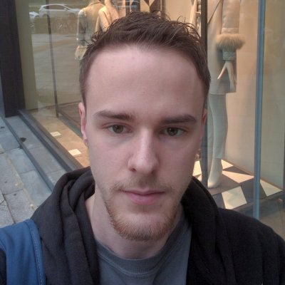

I'm a Belgian guy that likes participating in or organizing a lot of events. I have some experience with associations: I have been an active member of a Japanese culture association in Belgium for 4 years and was president for one year. In Japan, I have been a member of Osaka University International Student Association (OUISA), and finally, I have created 3 meetup groups in Osaka about parkour training, magic training and theater improvisation.
I hope to organize a lot of fun events on campus.

僕はベルギー人で、イベントを計画と参加するのがすきです。サークルの経験があります：ベルギーで日本文化協会に4年間メンバーで参加して、一年間部長を務めました。日本に来てからは、阪大のOUISA(阪大留学生会)に入部し、大阪にMeetupグループを三つ設立しました（パルクール、芸術、即興演劇）。
キャンパスに多くの楽しいイベントを作ろうと思っています！

---

###  **Yodo Atsushi (淀淳)** (*BS, M1*)
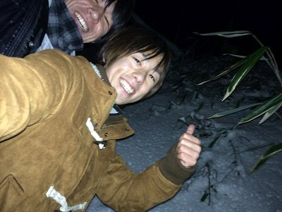

I’m from Osaka,Japan. Born and raised. My hobby is to play sports. I belong to NAIST FUTSAL CLUB and NAIST Baseball club. If you are interested in it, please come visit!

I think that Clubs and Events is few in NAIST. I want to increase clubs and events. And I feel that opportunities for student and school exchange of opinions are few in NAIST.So I think that NAIST Student Association is good idea. Please let me change NAIST. Thank you for reading.

---

###  **Felix von Drigalski** (*IS, D2*)
[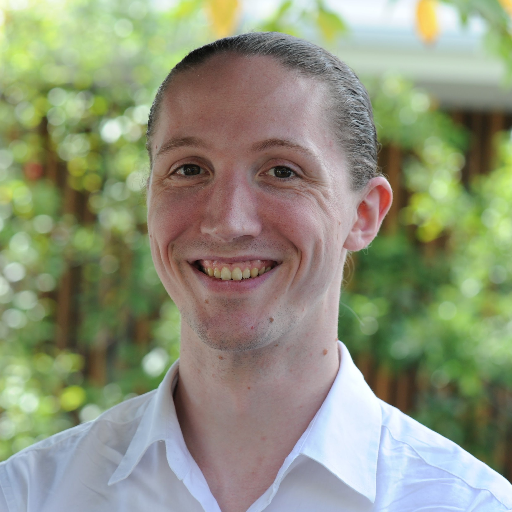](felix_b.jpg)

I am founder and president of the NAIST Recycling Club and organise the yearly Reuse Market.
I have served as treasurer of the KIT Mech. Eng. Student Association (~5000 students) and co-founded a design competition for renewable power plants.
I want to use the student association to make life better for all students, to support student clubs in making the campus life happen, and to promote the interaction between international and Japanese students. Concretely, I hope to achieve a shared space for student groups, student access to NAIST halls and online reservation for sports facilities (tennis & basketball courts etc).

NAISTリサイクルサークルの設立者と部長で毎年のリユースマーケットを行っています。
ドイツのKITの機械工学学生会(約5000人)の会計係を務め、自然エネルギー発電装置のデザインコンペティションを設立しました。
NAISTの学生会で全員の学生生活の改善、キャンパス生活のために頑張っているサークルの支援、日本学生と留学生のインタラクションの増進を目標とします。具体的には、サークルのための共用スペースの提供、NAISTの講義室のサークルへの開放、スポーツ設備（コートなど）のオンライン予約システムの開設です。

---

###  **Max (Taishi Sawabe)** (*IS, D1*)
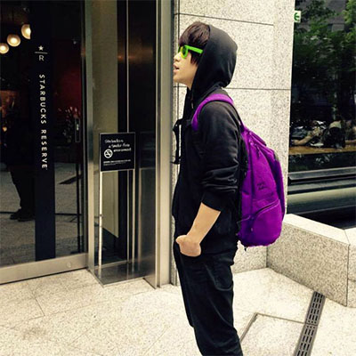

G'day mate. My name is Max (Taishi Sawabe) from Osaka, Japan. I am a D1 student at the Ambient Intelligence Laboratory. My main research field is about robotics and human, specifically the harmonization of autonomous vehicles and human passengers. Moreover, I found the international exchange community called “Oasis” in 2016. The purpose of Oasis is to connect international students and Japanese students by held meet up events and the international party to connect more students from the different university. For the future of NAIST university life, I would like to use my knowledge, skills and activities to make our university life more comfortable and more enjoyable.

みなさん、こんにちは。日本生まれ、大阪出身Max(澤邊太志)と申します。現在は、情報科学研究科の環境知能学研究室博士課程1年にて、自動走行と搭乗者の快適性に関する研究をしております。また研究外の活動とし、留学生と日本の学生を繋ぐ機会を増やすことを目的とした Oasisというコミュニティーを2016年度に立ち上げ、学内外で活動しております。Meet upや交流パーティーなどの活動を通して、学内外の留学生と学生が交流できる機会を今後とも増やしていきと思っております。現在学んでいる技術や知識、行なっている活動を通して、私たちの学生生活をより快適に、より楽しいものにしていきたいと思っています。よろしくお願いします。

---

###  **Miguel Angel Patino Gonzalez** (*IS, D1*)
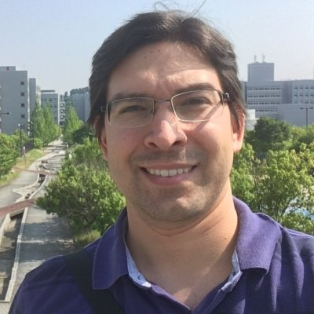

Hi All! My name is Miguel Patino, and I come from Paraguay. Currently, I am a D1 PhD Candidate within the Network Systems Lab. of G.S. of Information Science. After graduating from my Master’s in NAIST in March 2013, I came back to Paraguay for work, and returned to Japan again in April 2016. Both times as a Monbukagakusho scholar. I strongly believe the Students Association will make NAIST even better. Let’s share ideas, activities and knowledge. NAISTers must be all LEADERS!! I will be glad if you consider myself as your Representative for the Student Council. Thanks and Regards!!

皆さんこんにちは！僕はパラグアイから来たミゲルパティノです。今ネットワークシステムズ学研究室のD1です。2013年3月にNAISTの修士課程を卒業した後、仕事のためにパラグアイに帰りましたが、2016年4月再び日本に来ました（両方文部科学省の奨学金）。NAIST学生会はNAISTを改善できることを深く信じています。アイディアや活動や知識をシェアーしましょう。すべてのNAISTの学生は指導者でなければなりません！僕を学生会代表として選んでくれたらうれしいです。ありがとうございます！！

---

###  **Pedro Miguel Uriguen Eljuri** (*IS, M1*)
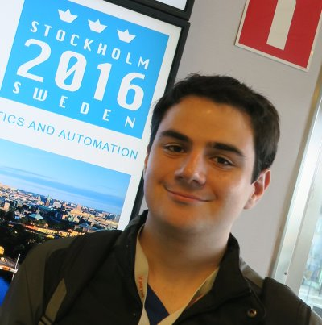

My name is Pedro Uriguen, I am from Ecuador and I am now a master student here in NAIST.
I think that NAIST students should share more moments apart from being all the time in the lab, enjoy the life in the university and have campus activities with the 3 graduate schools together.

ぺドロ・ウリグエンです。エクアドルから来ました。NAISTの修士課程に入りました。
NAIST学生は研究室外も時間をすごして、キャンパスでの生活を楽しんで、三つの研究科が一緒のイベントがあればいい。

---

###  **Rodrigo Elizalde** (*IS, M1 (from April / 4月から)*)
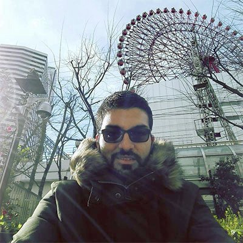

Hello, I am from Mexico, I am 28 years old and I used to work as a software analyst and developer at a bank company back at home. I arrived in Japan on April 2016 and in April I will become a M1 Student in the Software Engineering Lab. I am looking forward to participate on the student council.

こんにちは！僕は28歳のメキシコ人で、国でソフトウェアー解析と計画で銀行系会社に勤めていた。2016年4月に日本に来ました。今年の4月にソフトウェアー計画研究室の修士課程に入ります。学生会に参加を楽しみにしています！

---

###  **Yasuhiro Otoda** (*IS, M1*)
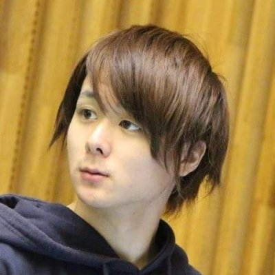

I am a M1 in the Ubuquitous Computing Systems Lab. I like reading and read about a book per week. I also change hair color a lot (and now it's blond)

情報科学のユビキタスコンピューティングシステム研究室のM1です。本を一週間で一冊ペースで読むくらい読書が好きです。よく髪色が変化します(いまは就活で黒色だけど

---

* **[How to vote / 投票方法](../voting)**
---
