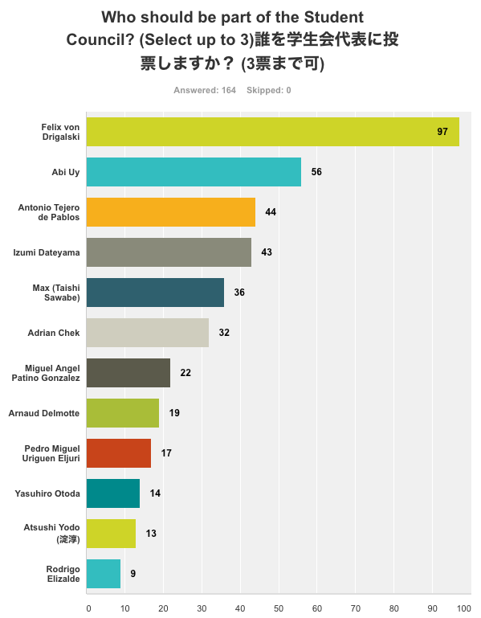

# Election Results 2016/2017　・　2016年度投票結果

The results of the Student Council election 2016 are as follows:

2016年度投票の結果は：

The members of the council who have accepted their nomination at the founding meeting on Tuesday, 31 January 2017 are:

では、2017年1月31日(火)のミーティングの時に決定された学生会代表は：

- Felix von Drigalski
- Abi Uy
- Antonio Tejero de Pablos
- Izumi Dateyama
- Max (Taishi Sawabe)
- Adrian Chek
- Miguel Angel Patiño González

The council has assigned the following roles:

下記の役を割り当てられました：

* **President: Felix von Drigalski**
* **Vice-Pres.: Izumi Dateyama**
* **Treasurer: Max (Taishi Sawabe)**
* **Secretary: Abi Uy**

## More information / 詳細情報

* [List of candidates / 立候補者の自己紹介](candidates)
* [What is the student association and what does it do? / 学生会とは？](introduction).
* [How to participate / 参加方法](participate)
* [Formal structure of the student council / NAIST学生会構成](structure)

[back](./)
